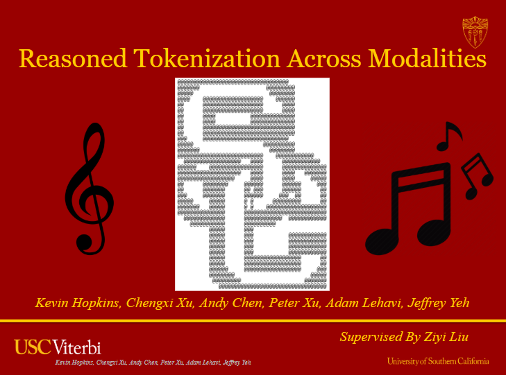

# Reasoned Tokenization Across Modalities

Processing ASCII Art and MusicXML Through Fundamental NLP Techniques

## Project Overview

This project investigates how unimodal language models can interpret non-traditional text representations—including ASCII art and MusicXML—when each modality is strictly processed as token sequences. We focus on LLaMA3.2 (1B parameters) augmented with an Entropix sampling strategy, testing its ability to classify ASCII-based visual structures and symbolic music content without resorting to multimodal architectures.

## Key Features

- Brightness-based encoding for ASCII art
- Text-only processing of MusicXML data
- Enhanced reasoning via Entropix sampling
- Cross-modal analysis of different text representations

## Repository Structure

The repository evolution followed two main development branches that ultimately merged into our final implementation files:

### Finetuning Development Branch
1. `finetune_llama_initial.ipynb` - Initial finetuning experiments
2. `reasoning_finetune.ipynb` - Enhanced reasoning capabilities
3. `entropix_llama_finetuned_on_reasoning.ipynb` - Final finetuning with Entropix

### Dataset and Pipeline Development Branch
1. `dataset_creation.ipynb` - Initial dataset preparation
2. `llama_with_tokenization_pipeline_and_custom_datasets.ipynb` - Custom tokenization implementation
3. `initial_llama_pipeline_with_evaluation.ipynb` - Complete evaluation pipeline
4. `music_finetuned_model.ipynb` and `ascii_finetuned_model.ipynb` - Additional finetuned models directly finetuned on MusicXML and our ASCII dataset, respectively

### Final Implementation Files
- `finetuned_entropix_model_in_full_pipeline_ASCII.ipynb` - ASCII art processing pipeline
- `finetuned_entropix_model_in_full_pipeline_MUSIC.ipynb` - MusicXML processing pipeline

## Resources

### Pre-trained Models
The main finetuned model on reasoning datasets can be accessed and downloaded from:
[Finetuned Model Drive Link](https://drive.google.com/drive/folders/1JLRRlIRUY0rQxp-EMlBhtTn-3JwyIKzP?usp=sharing)

### Datasets
MusicXML dataset available at:
[MusicXML Dataset](https://drive.google.com/file/d/10W3ShBO8c1Qtw2o-AE5sUfvX9NyJjAm_/view?usp=sharing)
